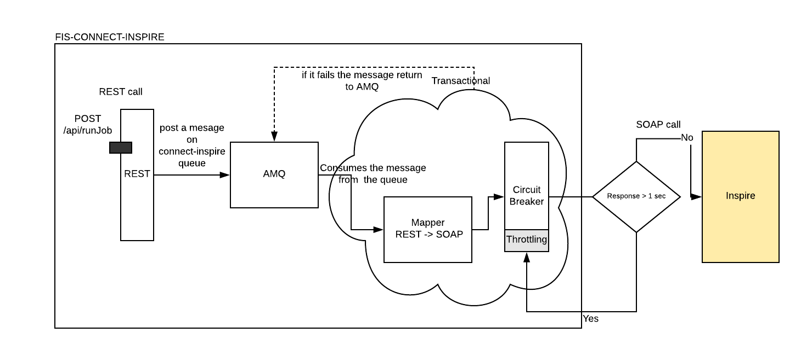

# FUSE Slow Backend

This application is a gateway to legacy backend application with performance/scalability problems. It has a mission to guarantee the 
message delivery and too throttling the connections when the backend starts to answer slowly. 

The main targets:

1. Guarantee of delivery - No messages could be lost.
2. Throttling - Enable throttling when the backend starts to answer slowly.

Solution design:

## Build

    mvn clean install

## Running

    mvn sprint-boot:run

## Running in OpenShift (dev)

    oc cluster up / minishift cluster up
    sh infra/setup.sh 
pos
## Deploy on Openshift 

    mvn fabric8:deploy

## Testing the application

Do a HTTP POST in the endpoint http://localhost:8080/api/orders

Using the body:

    {
        "item": "Inserting a order",
        "amount": 2,
        "description": "Testing order insert",
        "processed": true
    }